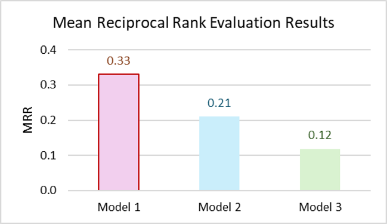

# Evaluate Sentence-Transformer Models for Semantic Search Engine

This repository is dedicated to evaluating Sentence-Transformer models optimized for use within a semantic search engine. Our goal is to fine-tune and assess various Sentence-Transformer models to enhance the relevancy and accuracy of search results in semantic search with Amazon OpenSearch.

## Overview

Semantic search engines use understanding beyond keyword matching to interpret the intent and contextual meaning of search queries. By leveraging Sentence-Transformer models, we aim to significantly improve the search experience, offering users more accurate, context-aware results.


## Model Fine-Tuning Script


### Prerequisites

Before running the script, ensure you have the following:
- Python 3.x installed
- Access to a command-line interface (CLI)
- Necessary permissions to run bash scripts and Python scripts on your system
- The required Python environment and dependencies installed

### Setup

1. **Clone the Repository:**
   Ensure that you have the repository cloned to your local machine.

2. **Environment Setup:**
   Ensure that your Python environment is set up correctly and that all required packages are installed. 

   ```bash
   pip install -r finetune/requirement.txt
   ```

3. **Data Preparation:**
   Prepare your training data and note its file path. The data file should be in `.parquet` format for the given Python script.

### Running the Script

To run the script, you'll need to pass three arguments: the path to the training data, the directory where the model should be saved, and the number of training epochs.


1. **Run the Bash Script:**
   Execute the bash script with the required arguments. Here is the format for running the script:

   ```bash
   bash finetune/finetune.sh [path_to_training_data] [model_save_directory] [num_train_epochs]
   ```

   Replace `[path_to_training_data]` with the full path to your training data, `[model_save_directory]` with the path where you want the trained model to be saved, and `[num_train_epochs]` with the number of epochs for training.

   Example:
   ```bash
   bash finetune/finetune.sh  /path/to/training/data /path/to/save/directory 5
   ```

### Notes

- Ensure that the paths provided are accessible and the user has the necessary read/write permissions.
- Adjust the number of epochs according to your model requirements and hardware capabilities.


## Model Evaluation Pipeline and Results
### Evaluation Pipeline 
We fine-tuned three widely used sentence-transformer (SBERT) models: **all-MiniLM-L6-v2**, **all-mpnet-base-v2**, and **paraphrase-multilingual-MiniLM-L12-v2** using geospatial metadata. To evaluate the performance of these models, we created a benchmark dataset of curated queries and responses, informed by domain expertise. The evaluation pipeline is as follows:


### Evaluation Results 
We selected **Mean Reciprocal Rank at 5 (MRR@5)** and **Accuracy at 5 (ACC@5)** to measure the performance of the models. 

- **MRR@5** measures how well a system ranks the ground truth within the top 5 positions of its search results. Specifically, MRR@5 looks at the position of the first relevant result in the top 5 and computes the reciprocal of that rank. If there is no relevant result in the top 5, the reciprocal rank is zero.
  
- **ACC@5** measures the proportion of queries for which at least one relevant result appears within the top 5. It ranges from 0 to 1, where a perfect score of 1 means that, for every query, there is at least one relevant result in the top 5.

The evaluation results are included in the graphs below.  **Model 1** is **all-mpnet-base-v2**, **Model 2** is **all-MiniLM-L6-v2**, and **Model 3** is **paraphrase-multilingual-MiniLM-L12-v2**.




